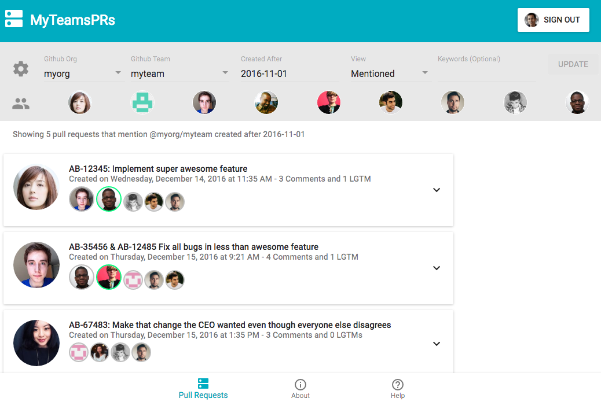

# MyTeamsPRs

[MyTeamsPRs](https://myteamsprs.com) is a site that allows you to 
* view all your different teams' Github pull requests 
* assign/unassign reviewers to pull requests
* see which participants and reviewers have marked a pull request as LGTM

Use the [Issues tab above](https://github.com/MyTeamsPRs/MyTeamsPRs/issues) to submit feedback, questions or bug-reports.

## Example

